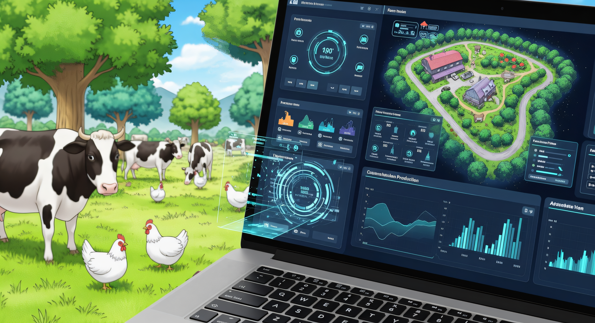

# SAE24 - Projet Intégratif - Groupe 9 
___

- Défi 6 : Surveillance Sonore Intelligente et Protection du Poulailler
- IUT de Béziers, RT1
- 13/05/2025

___




# Déploiement du projet :
___

Afin d’installer notre projet vous devez vous munir d’une machine virtuelle ou d’une machine physique équipée d’une version récente et à jour de Debian (apt update && apt upgrade).

La configuration minimum est la suivante : 

- 1 coeur physique
- 1 thread (coeur logique)
- 2 Go de RAM
- 5 Go de stockage libre (Pour les images et les volumes)

Prérequis divers : 

- Un utilisateur non privilégié (autre que root)
- Se placer dans le répertoire suivant : ~

Si vous remplissez les conditions ci-dessus, vous pouvez passer à l’étape suivante

## Installation de docker (Debian)
___

```python
# Add Docker's official GPG key:
sudo apt-get update
sudo apt-get install ca-certificates curl
sudo install -m 0755 -d /etc/apt/keyrings
sudo curl -fsSL https://download.docker.com/linux/debian/gpg -o /etc/apt/keyrings/docker.asc
sudo chmod a+r /etc/apt/keyrings/docker.asc

# Add the repository to Apt sources:
echo \
  "deb [arch=$(dpkg --print-architecture) signed-by=/etc/apt/keyrings/docker.asc] https://download.docker.com/linux/debian \
  $(. /etc/os-release && echo "$VERSION_CODENAME") stable" | \
  sudo tee /etc/apt/sources.list.d/docker.list > /dev/null
sudo apt-get update
sudo apt-get install docker-ce docker-ce-cli containerd.io docker-buildx-plugin docker-compose-plugin
```

Installez par la suite docker-compose : 

```python
curl -SL https://github.com/docker/compose/releases/download/v2.37.0/docker-compose-linux-x86_64 -o /usr/local/bin/docker-compose
chmod +x /usr/local/bin/docker-compose
```

Vous pouvez tester votre installation en lançant ce conteneur : 

```python
sudo docker run hello-world
```

## Clonage du repo GIT et installation
___

Maintenant que docker est opérationnel, il vous faut les fichiers de notre projet, ils sont répertoriés sur un dépôt git sur GitHub, vous pouvez utiliser les commandes suivantes pour cloner le dépôt et lancer le projet.

> Parfois, pour les commandes Docker, il est peut être nécessaire de mettre un tirait du 6 “**-**” entre docker et compsoe comme ceci : docker-compose.
Ce n’était pas notre cas car les commandes avec docker compose fonctionnaient
> 

```python
git clone https://github.com/fr-AlphaP/SAE_INT
cd ~/SAE_INT
docker compose up -d # ou 
# docker-compose up -d
```

Actions diverses

SI les commandes ne marchent pas, mettez un - entre docker et compose : docker-compose

```python
docker compose restart # Redémmare les conteneurs
docker compose down # Stop les conteneurs et les supprime
docker compose stop # Stop les conteneurs

docker volume ls # Liste les volumes (ou sont stockées les données de chacun des services)
docker ps -a # Affiche tous les conteneurs (Même ceux éteins)
```

## Désinstallation
___

```python
cd ~
docker compose down # ou docker-compose down
cd ../
rm -rf SAE_INT
```

### Retrait de Docker (non recommandé)

```python
for pkg in docker.io docker-doc docker-compose podman-docker containerd runc; do sudo apt-get remove $pkg; done

```

# Réaliser des modifications sur le projet :
___

## Identifiants et mots de passe :


Afin de modifier les identifiants administrateur pour les applications du projet, placez vous dans le dossier secrets de SAE_INT à l’aide de cette commande :

```python
cd ~/SAE_INT/secrets
```

Lorsque vous réalisez un ls, vous avez tous les fichiers relatifs aux configurations 
Afin de modifier identifiants, modifiez ces fichiers : 

- grafana-admin-password : Mot de passe admin de Grafana
- grafana-admin-username : Nom d’utilisateur administrateur par défaut
- influxdb2-admin-password : Mot de passe de la base de donnée InfluxDB
- influxdb2-admin-token : Token unique qui permet à Grafana deparler à InfluxDB
- influxdb2-admin-username : Nom d’utilisateur admin de InfluxDB
